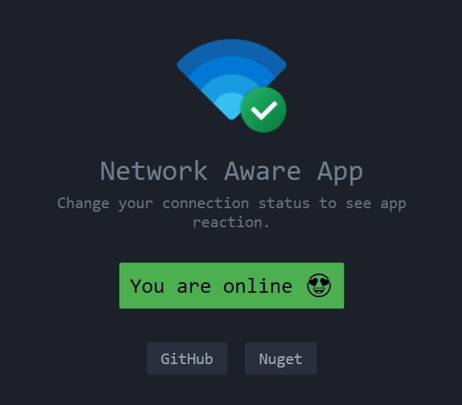
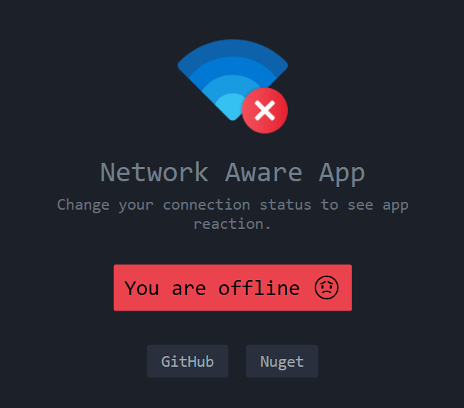

<div align="center">
    
    <h1>Netify</h1>
    <p>Instantly get notified when the network connection changes.</p>
    <a href="https://www.nuget.org/packages/Netify/">
        
    </a>
</div>

## Installation

You can add Netify to your project using .NET CLI:

```
dotnet add package Netify
```

or NuGet package manager console:

```
Install-Package Netify
```

## Example Usage

```c#
using Netify;
using static System.Console;

var networkStatusNotifier = new NetworkStatusNotifier();
var sampleApp = new SampleApp(networkStatusNotifier);

networkStatusNotifier.Start();
sampleApp.DoSomething();
networkStatusNotifier.Stop();

internal class SampleApp : INetworkObserver
{
    public SampleApp(INetworkStatusNotifier networkStatusNotifier)
    {
        networkStatusNotifier.AddObserver(this);
    }

    public void ConnectivityChanged(ConnectivityStatus status)
    {
        WriteLine($"Connectivity status changed: {status}");
    }

    public void DoSomething()
    {
        WriteLine("Change your connection status to see app reaction.");
        ReadKey();
    }
}
```

## Demo App
<p align="center">
    
    
</p>
